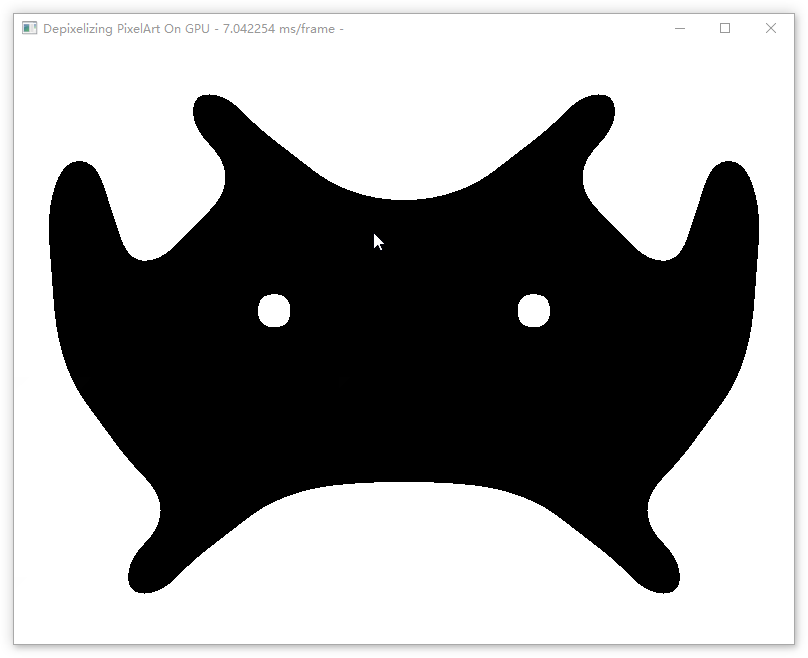

# Results





# Introduction
- The original project [[Github - Depixelizing Pixel Art On Gpus](https://github.com/falichs/Depixelizing-Pixel-Art-on-GPUs)] haven't updated for 4 years and can't run on my environment
- I try to fix it and now it works fine on my pc
- This fix is based on VS2019, but if you still want to use cmake, I listed all the problems I fixed for you

# Changes
- change cmake to vs2019
- change glew to glad
- unzip the examples and update bats
- add a release exe with dll compiled on my pc

# Requirement
- glad (already in the project)
- boost, boost_program_options (online nuget packages)
- glfw (online nuget packages)
- freeimage (online nuget packages)

# Fix the project
I meet some problems when I try to run the project
- GLEW report 1280 Invalid Enum Error after calling glewInit(), which may impact nothing on result but distrub my debugging, so I switch to glad.
- When loading shaders, ```glGetShaderiv(VertexShaderID, GL_INFO_LOG_LENGTH, &InfoLogLength)``` return InfoLogLength with 0, and later it access a std::vector with the length of InfoLogLength (which is 0 for now), and it causes a crash. I fix it by skip it when InfoLogLength is 0.
- When compiling shaders, an error ```ERROR: *:*: 'gl_VertexID' :identifiers starting with "gl_" are reserved``` occurs. It seems there is ```in int gl_VertexID;``` in shaders, where the ```gl_VertexID``` is a bulit variable and should not be implicitly declared. So I remove these declaration from all shader.
- When init ```SimilarityGraphBuilderFS```, an uniform location ```m_uniformID_indifferentColors_pixelArt``` refer to location 0, which is valid. But the later check assume 0 is invalid and exits with error. Fix the check will fix the problem.

# The Origin README
DEPIXELIZING PIXEL ART ON GPUS - http://www.cg.tuwien.ac.at/research/publications/2014/KREUZER-2014-DPA/
based on: http://research.microsoft.com/en-us/um/people/kopf/pixelart/

THIS SOFTWARE WAS TESTED ON WINDOWS WITH NVIDIA GPUs ONLY!
IT WILL NOT RUN ON INTEL GPUs

This application is intended to be a preview for my gpu-supported implementation of the DEPIXELIZING PIXEL ART algorithm.
You can either load a single image, or a sequence of images (images in a sequence must have the same resolution).
The window title displays the current rendering speed. See section controls below for usage.

========== BUILDING FROM SOURCE: ==========

Requirements:
CMAKE(http://www.cmake.org/) to configure and generate a Visual Studio solution.

This project requires boost::program_options.
Easy way to get it:
Download boost source from boost.org.
Set BOOST_ROOT environment variable to the path which contains the boost source.
Open up a command prompt and enter the following commands:

cd %BOOST_ROOT%
bootstrap
b2 --with-program_options

...and you're done setting up boost for this project.

Then open CMAKE and set the source directory to this directory. Choose any binary directory you want and give it a go.

========== STARTUP: ==========

Usage: GPUPixelArt.exe [options]
Allowed options:
  --help                      produce help message
  -I [ --input-file ] arg     input file
  -S [ --input-sequence ] arg input sequence name
  --sequence-count arg        input sequence count
  --sequence-fps arg (=15)    input sequence playback fps
  --height arg (=600)         output vertical size in pixel

Use either the -I or the -S options!
If you want to use the sequence option -S then do not forget to add the --sequence-count and --sequence-fps arguments!

Make a release build and extract examples.zip into the "bin" directory (the directory where the Release folder is located in).
Feel free to try the startXXX.bat files. You can use them to start the supplemented image sequences.
I do not own any copyrights to the pictures in examples.zip (copyrights owned by Nintendo Co., Ltd.).

========== CONTROLS: =========
SPACE 					... pause sequence
MOUSEWHEEL 				... control zoom
LEFT_SHIFT + MOUSEWHEEL	... change sequence playback speed

S 						... screenshot 

DEBUGGING:
F1		... draw depixelized Pixel Art (default)
F2		... draw using Nearest Neighbor Interpolation
F3		... draw Simplified Voronoi Regions
F4		... draw B-Splines
F5		... toggle Optimization (has effect on F1&F4 mode)
F6		... toggle debug graph overlays (effects F2&F3 mode)

(C) Felix Kreuzer, falichs@gmail.com